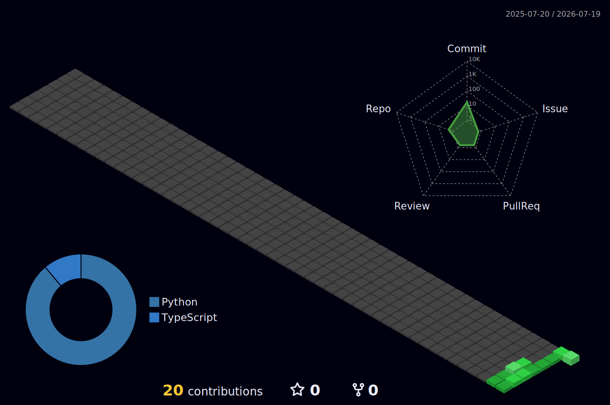

<!-- Animated Terminal Profile Card (Supports Dark/Light Mode) -->
<div align="center">
  <a href="https://github.com/Guthub183">
    <picture>
      <source media="(prefers-color-scheme: dark)" srcset="./dark.svg" />
      
    </picture>
  </a>
</div>


<div align="center">

[](https://github.com/Guthub183)

<a href="https://github.com/Guthub183"></a>
<a href="https://github.com/Guthub183/resume.html"></a>


</div>

<br/>

<!-- Snake Animation -->
<div align="center">
  <picture>
    <source media="(prefers-color-scheme: dark)" srcset="https://raw.githubusercontent.com/Guthub183/Guthub183/output/github-snake-dark.svg" />
    <source media="(prefers-color-scheme: light)" srcset="https://raw.githubusercontent.com/Guthub183/Guthub183/output/github-snake.svg" />
    
  </picture>
</div>

---

<table>
<tr>
<td width="50%" valign="top">

##  About Me

```js
const satya = {
  pronouns: "he" | "him",

  education: {
    institution: "Institute of Management Studies, Ghaziabad",
    degree: "Bachelor of Computer Application"
  },

  roles: [
    "Open Source Contributor",
    "AI Framework Developer",
    "Database Designer"
  ],

  currentlyLearning: ["System Design", "ML/AI", "Database Systems"],

  funFact: "Harvard CS50 AI projects completed",

  askMeAbout: [
    "Python", "AI Frameworks",
    "MCP Development", "Database Design"
  ]
};
```

</td>
<td width="50%" valign="top">

##  GitHub Stats


</td>
</tr>
</table>

---

##  Tech Arsenal

<div align="center">

**Languages**


**Frameworks & Tools**


<div align="left" style="margin-top: 15px;">

- **Flutter**: Cross-platform mobile application development.
- **Power BI** & **Excel**: Business intelligence, data analysis, and reports.
- **Git** & **Docker**: Version control & application containerization.
- **Linux**: Operating system environment.
- **Amazon Web Services (AWS)**: Cloud computing & Generative AI tools (Amazon Bedrock / PartyRock, AWS Skill Builder).
- **TensorFlow**: Machine learning & deep learning framework.
- **NumPy** & **Pandas**: Scientific computing and data analysis in Python.
- **Matplotlib**: Data visualization and plotting.
- **Scikit-Learn**: Machine learning algorithms and models.
- **Hadoop / Big Data**: Distributed storage and large-scale data processing.

</div>

---

##  Featured Projects

<div align="center">

### 💻 Projects & Labs

</div>

<table>
<tr>
<td align="center" width="100%">

<br/><br/>
<b>CS50 AI Projects</b>
<br/>
<sub>Artificial Intelligence in Python</sub>
<br/><br/>
<a href="https://github.com/Guthub183/Harvard-CS50s-Introduction-to-Artificial-Intelligence-with-Python-Projects"></a>
</td>
</tr>
</table>


---

##  Analytics & Metrics

<div align="center">


</div>

<details>
<summary><b>📊 More Stats</b></summary>
<br/>

<div align="center">


</div>

</details>

<details>
<summary><b>🏆 GitHub Trophies</b></summary>
<br/>

<div align="center">


</div>

</details>

<details>
<summary><b>📈 3D Contribution Graph</b></summary>
<br/>

<div align="center">
  
</div>

</details>


##  Connect & Collaborate

<div align="center">

<a href="https://github.com/Guthub183"></a>
<a href="mailto:ksatyapranav6@gmail.com"></a>

<br/><br/>

<a href="https://github.com/Guthub183"></a>
<a href="https://linkedin.com/in/k-satya-pranav-9240b9321"></a>
<a href="https://x.com/k-satya-pranav-9240b9321"></a>

<br/><br/></div>

---

<div align="center">

### 💭 Random Dev Quote


</div>

---

<div align="center">


** Thanks for stopping by!**

*"The best way to predict the future is to create it."*

</div>


